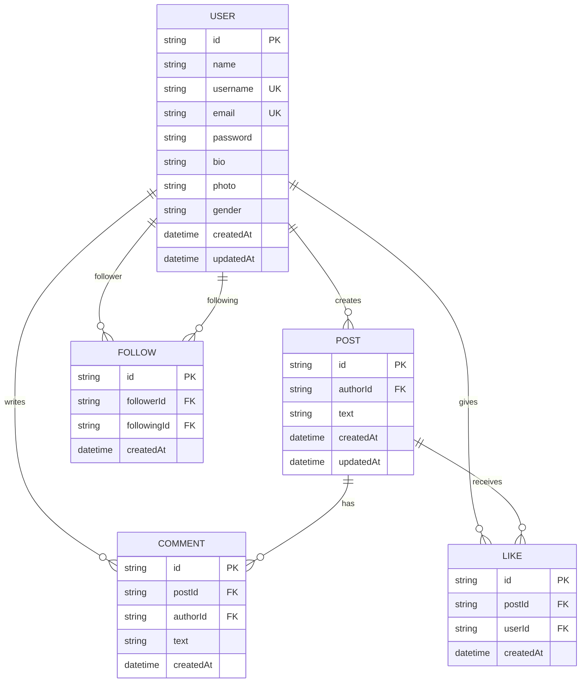
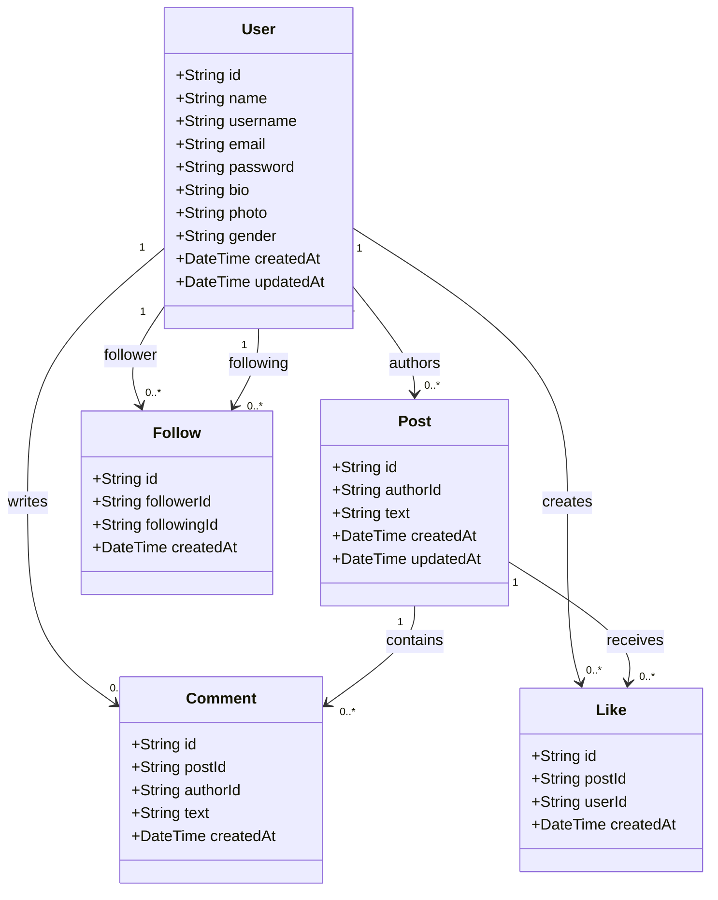
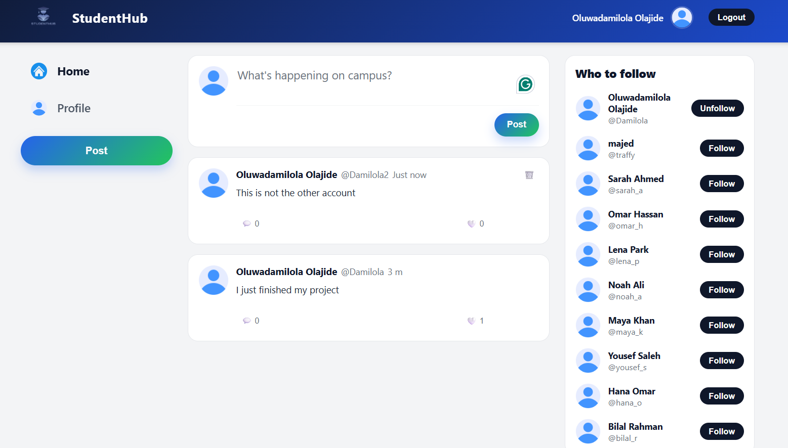
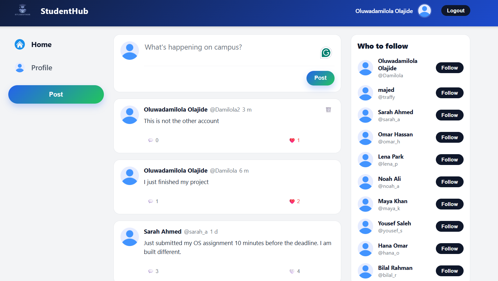
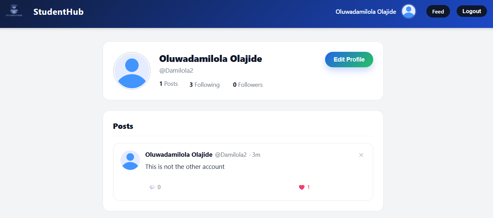
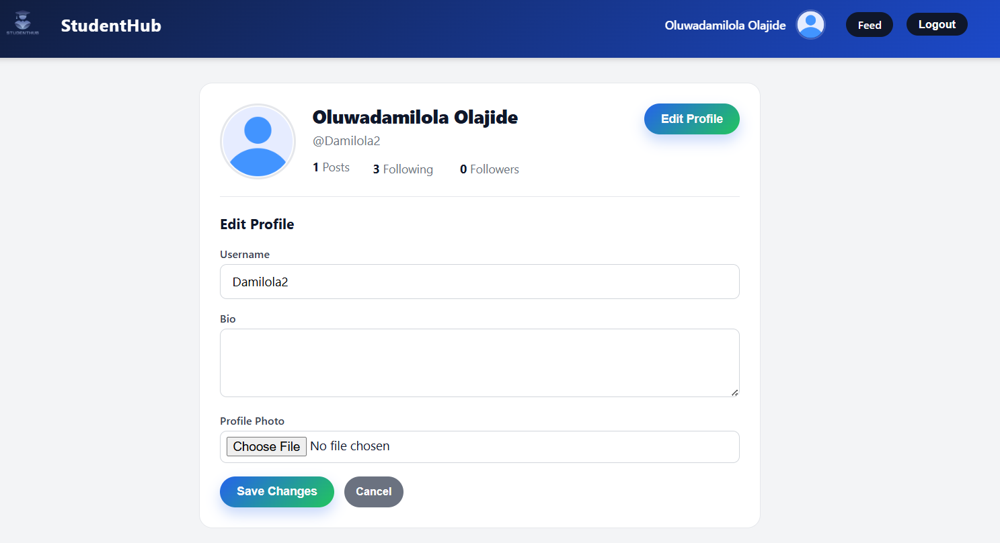
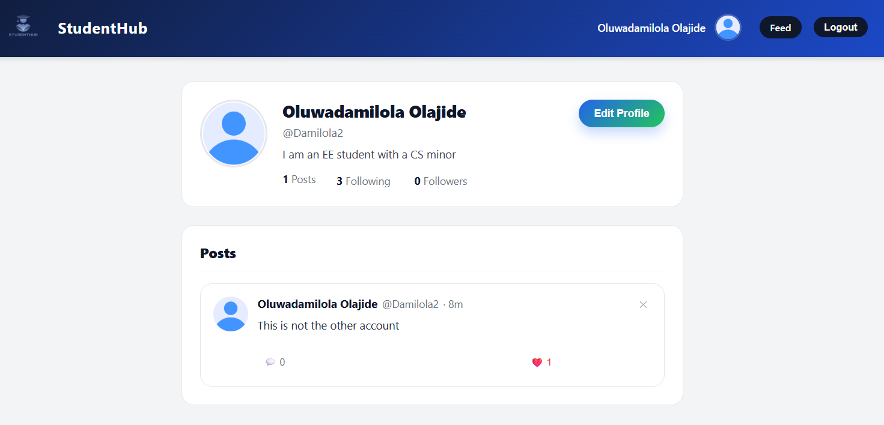
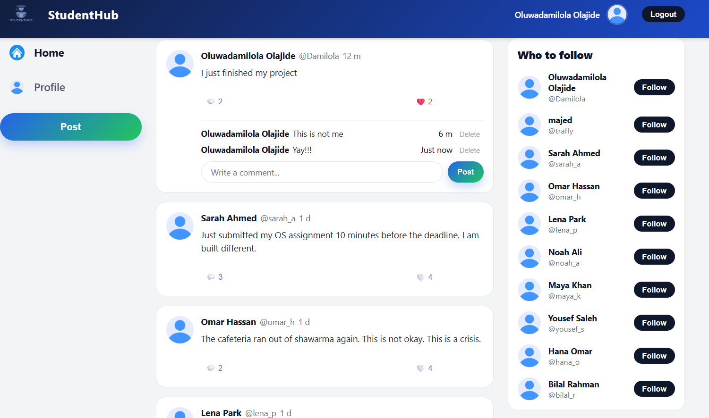
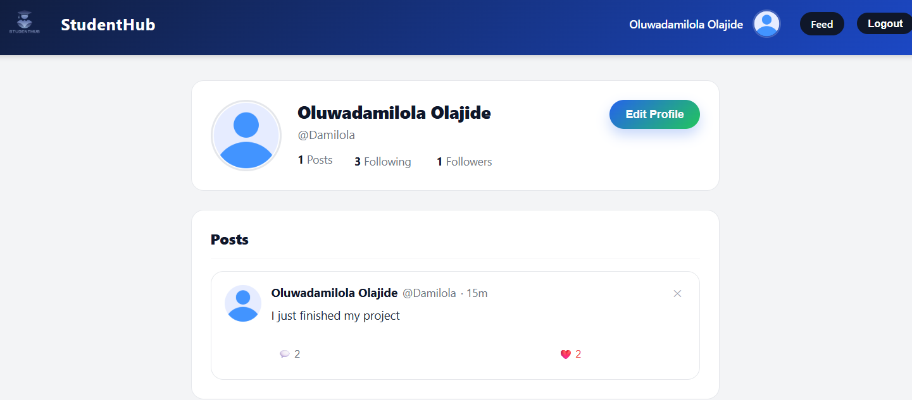

# StudentHub Data Model

## Team Member Contributions

The following table summarizes each team member's contribution to this phase of the project.


| Team Member                  | QUID      | Contribution                                               | Percentage |
| ---------------------------- | --------- | ---------------------------------------------------------- | ---------- |
| Najeeb Abdurahman Abdi       | 202307172 | Worked on the statistics use-case and Phase 1 integration. | 25%        |
| Oluwadamilola Olajide        | 202109926 | Worked on the database, testing, and query design.         | 25%        |
| Majid Marzouq                | 202309136 | Worked on the database, testing, and query design.         | 25%        |
| Mohamed Othman Aoussat Ayari | 202304380 | Worked on the statistics use-case and Phase 1 integration. | 25%        |

Total contribution: 100%.



## Notes

- `User.username` is unique.
- `User.email` is unique.
- `Like` has a composite uniqueness rule on `(postId, userId)`, so one user can like a post only once.
- `Follow` has a composite uniqueness rule on `(followerId, followingId)`, so one user can follow another user only once.
- Deleting a `User` cascades to their posts, comments, likes, and follow records.
- Deleting a `Post` cascades to its comments and likes.

## UML / Class-Style Diagram



### UML Notes

- `Like` works as an association class between `User` and `Post`.
- `Follow` is a self-referencing association class between `User` and `User`.
- If you want a more conceptual UML version, `Like` and `Follow` can also be shown as many-to-many associations with constraint notes instead of full classes.

## Sample Database Queries

These queries were run against the current repository database file: [seed.db](C:\Users\damil\OneDrive - Qatar University\FInal Year First Sem\CMPS 350\StudentHub\prisma\seed.db:1).

Note: results reflect the current contents of that SQLite file at the time of documentation and may differ after reseeding or adding new records.

### 1. Count records in each table

```sql
SELECT
  (SELECT COUNT(*) FROM User) AS users,
  (SELECT COUNT(*) FROM Post) AS posts,
  (SELECT COUNT(*) FROM Comment) AS comments,
  (SELECT COUNT(*) FROM "Like") AS likes,
  (SELECT COUNT(*) FROM Follow) AS follows;
```

Result:

```text
users: 9
posts: 10
comments: 14
likes: 22
follows: 16
```

### 2. Number of posts per user

```sql
SELECT u.username, COUNT(p.id) AS post_count
FROM User u
LEFT JOIN Post p ON p.authorId = u.id
GROUP BY u.id, u.username
ORDER BY post_count DESC, u.username ASC;
```

Result:

```text
omar_h   2
sarah_a  2
bilal_r  1
hana_o   1
lena_p   1
maya_k   1
noah_a   1
yousef_s 1
traffy   0
```

### 3. Top 3 most-liked posts

```sql
SELECT p.id, u.username AS author, substr(p.text, 1, 50) AS post_preview, COUNT(l.id) AS like_count
FROM Post p
JOIN User u ON u.id = p.authorId
LEFT JOIN "Like" l ON l.postId = p.id
GROUP BY p.id, u.username, p.text
ORDER BY like_count DESC, p.createdAt DESC
LIMIT 3;
```

Result:

```text
p_seed1  sarah_a  Just submitted my OS assignment 10 minutes before  4
p_seed2  omar_h   The cafeteria ran out of shawarma again. This is n 3
p_seed3  lena_p   Finished my UI mockup for the semester project. Fi 2
```

### 4. Most-followed users

```sql
SELECT u.username, COUNT(f.id) AS follower_count
FROM User u
LEFT JOIN Follow f ON f.followingId = u.id
GROUP BY u.id, u.username
ORDER BY follower_count DESC, u.username ASC
LIMIT 5;
```

Result:

```text
sarah_a  4
lena_p   3
omar_h   3
maya_k   2
bilal_r  1
```

### 5. Comment counts per post

```sql
SELECT p.id, u.username AS author, COUNT(c.id) AS comment_count
FROM Post p
JOIN User u ON u.id = p.authorId
LEFT JOIN Comment c ON c.postId = p.id
GROUP BY p.id, u.username
ORDER BY comment_count DESC, p.id ASC
LIMIT 5;
```

Result:

```text
p_seed1   sarah_a  3
p_seed10  omar_h   2
p_seed9   sarah_a  2
p_seed2   omar_h   1
p_seed3   lena_p   1
```

### 6. Mutual follow relationships

```sql
SELECT u1.username AS follower, u2.username AS following
FROM Follow f1
JOIN Follow f2
  ON f1.followerId = f2.followingId
 AND f1.followingId = f2.followerId
JOIN User u1 ON u1.id = f1.followerId
JOIN User u2 ON u2.id = f1.followingId
WHERE u1.username < u2.username
ORDER BY u1.username, u2.username;
```

Result:

```text
hana_o  maya_k
lena_p  sarah_a
omar_h  sarah_a

```

7. Using a second account to follow the first account



8. Following another account to show that only accounts that I follow have their posts displayed



9. Viewing my profile of the second account to check the posts I have



10. Trying to edit my profile



11. Added a bio and saved changes



12. Showing feed when I do not follow anyone



13. Showing that I now have a follower after I followed myself from my other account


